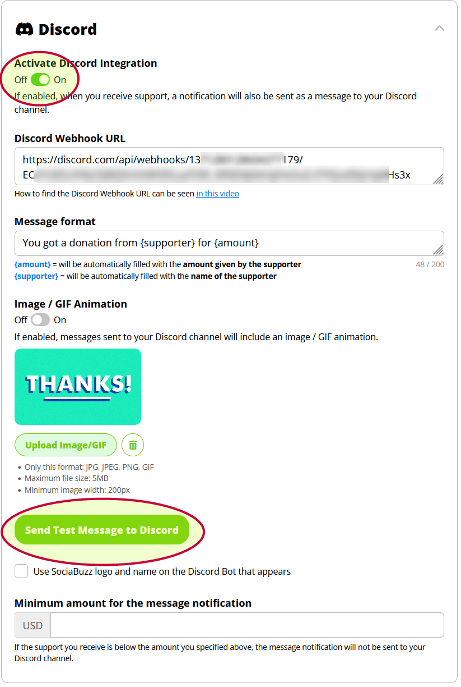
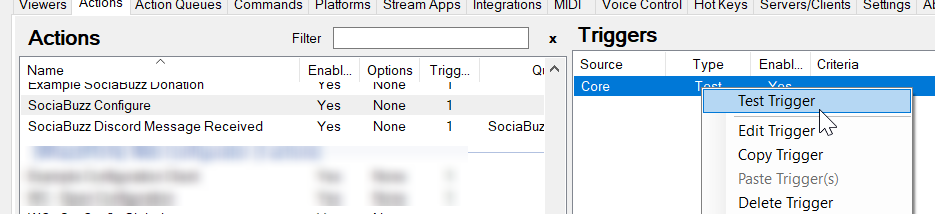
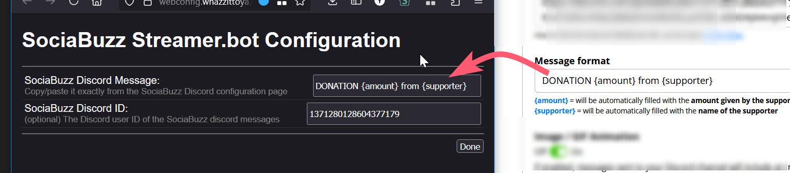

# SociaBuzz Integration for Streamer.bot

This is a [Streamer.bot](https://streamer.bot) extension which integrates the [SociaBuzz](https://sociabuzz.com) monetization platform with Streamer.bot. It currently supports a trigger for receiving TRIBE donations.

**Note**: You must have a Discord server for this extension to work.

## Installation

### Install DiscoBot

The extension relies on Discord and the DiscoBot extension to receive donation notifications, as SociaBuzz does not provide a direct way for Streamer.bot to receive them.

Go to [Mustached Maniac's DiscoBot page](https://mustachedmaniac.com/multi-platform-extensions/discobot-discord-integration) and follow the instructions to download and install version 1.1 or newer, and configure it to work with your Discord server. The donation is optional, but encouraged.

**Note: DiscoBot 1.1 or newer is required**

### Set up SociaBuzz Discord Notifications

Decide what channel you want the donation messages to appear in. If you don't want them visible in your Discord, create a private channel for the messages.

Log in to your SociaBuzz account, and [follow the instructions](https://sociabuzz-en.freshdesk.com/support/solutions/articles/153000137297-get-notifications-on-my-discord-tribe-) to set up a Discord webhook for the channel you have chosen, and SociaBuzz notifications to use that webhook.

Use the "Send Test Message" to make sure it's working, and don't forget to activate it.

Leave the SociaBuzz discord integration window open for now, as you'll need it later.

### Set Up the SociaBuzz Extension

#### Install
In Streamer.bot, follow the standard procedure for installing an extension:
1. Download the [SociaBuzz.sb file](https://github.com/WhazzItToYa/Streamerbot-SociaBuzz/blob/main/SociaBuzz.sb), or copy the contents.
2. Click "Import" in Streamer.bot
3. Drag the .sb file (if downloaded), from your Downloads folder into the "Import String" box, or paste it if you copied it right from the page.
4. On import, it should automatically open a browser page for editing the extension's configuration, in the next section.

#### Configure

1. Go to the configuration editor that opened up on install. If you declined to run it automatically, or closed the window, find the "SociaBuzz Configure" action, right-click the Test trigger, and click "Test".
    
2. For "SociaBuzz Discord Message", copy the "Message Format" field from your SociaBuzz discord settings.
    
3. In the SociaBuzz setting window, click the "Send Test Message" button. You should see a sample notification from SociaBuzz appear in Discord, and in your Twitch chat, a corresponding sample "thank you" message should get sent.
4. (optional, but recommended) Set "SociaBuzz Discord ID" to SociaBuzz notifcations' user ID in Discord.  You can get the ID by:
    1. In Discord Developer mode (settings > Advanced > Developer Mode), right click on the SociaBuzz account on the donation message, and select Copy User ID
    2. In Streamer.bot, go to Action Queues > Action History, and double-click on the "SociaBuzz Discord Message Received" action. Find the `discord.UserID` argument, right-click on the ID in the right column, and select "Copy".

## Usage

### Donation Trigger

The extension adds a **Custom > SociaBuzz > Donation** trigger to Streamer.bot which fires every time SociaBuzz receives a donation and sends a message to your Discord.

The trigger sets the folowing arguments:

| name | description | example |
|------|-------------|----|
| `donationAmount` | The numeric amount of the donation | 3, 4.1 |
| `donationCurrency` | The currency code of the donation | "USD", "IDR" |
| `donationFrom` | The name appearing in the donation. Note: These are not Twitch usernames. | "Jessica" |

The extension contains an "Example SociaBuzz Donation" action which demonstrates uses the trigger to send the chat message.

### Changing the Discord message

SociaBuzz lets you customize the Discord message that it sends to your server. If you do change it, then you must go back to the extension's configuration page (see instructions above for how to open it) and update "SociaBuzz Discord Message" to match.

Note that the message must contain the `{amount}` and `{supporter}` placeholders, in order for the extension to parse the `donationAmount` and `donationFrom` arguments out of the messages.

## Notes/Caveats

**No Offline Donations**: This extension only monitors donations when Streamer.bot is running. Any donations that occur while Streamer.bot is closed, will still be delivered to your Discord server, but will not fire the donation trigger in Streamer.bot, even after Streamer.bot is restarted. Perhaps a future version will be able to catch up on missed donations.

## Acknowledgements

Thank you to [Mustached Maniac](https://mustachedmaniac.com/) for the awesome DiscoBot, and the changes he made specifically to support this extension.

Thanks to Nate for creating the Streamer.bot tool, and the community that supports it.

## Support, Contact

* For feature requests or bug reports: https://github.com/WhazzItToYa/Streamerbot-SociaBuzz/issues 
* Or submit a pull request
* Or if you can't do either of those things, ping me through the Streamer.bot Discord in the [SociaBuzz post](https://discord.com/channels/834650675224248362/1373459135663968327/1373459135663968327)

