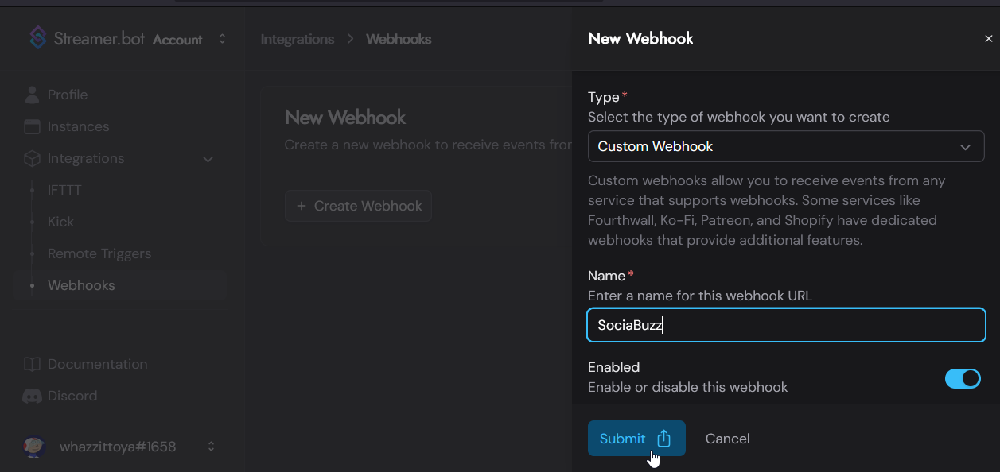
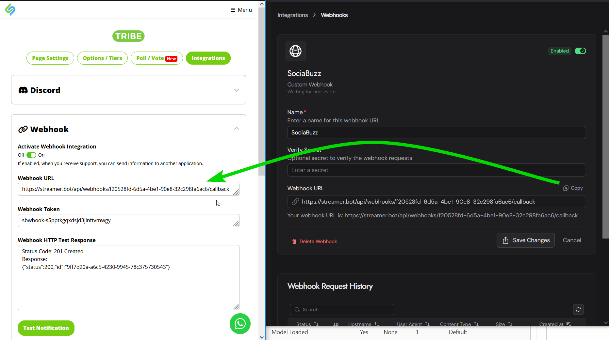

# Setting up SociaBuzz Webhook Notifications

## Install the SociaBuzz Extension

### Install
In Streamer.bot, follow the standard procedure for installing an extension:
1. Download the [SociaBuzz.sb file](https://github.com/WhazzItToYa/Streamerbot-SociaBuzz/blob/main/SociaBuzz.sb), or copy the contents.
2. Click "Import" in Streamer.bot
3. Drag the .sb file (if downloaded), from your Downloads folder into the "Import String" box, or paste it if you copied it right from the page.
4. On import, it might automatically open a browser page for editing the extension's configuration.  You can close it without configuring anything.
5. If necessary, connect Streamer.bot to the Streamer.bot Website, under the Integrations tab.

## Create a Streamer.bot Webhook

1. Go to the [Streamer.bot Webhooks page](https://streamer.bot/user/integrations/webhooks), logging in with your Discord account if you need to.
2. Click "Create Webhook", with the following options, and hit "Submit"
    * Type = Custom Webhook
    * Name = "SociaBuzz"
    * Enabled = Yes

3. Press the "Configure" button on the webhook you just created, to reveal the Webhook URL that you'll need in the next section.

## Configure SociaBuzz for Webhook Notifications

Log in to your SociaBuzz account, and [follow the instructions](https://sociabuzz-en.freshdesk.com/support/solutions/articles/153000194805-webhook-tribe-feature-) to set up a Webhook integration:
* Copy the Streamer.bot webhook URL into SociaBuzz's "Webhook URL" field.
* Activate the webhook
* Press "Test Notification". You should see a test notification message in your chat.

